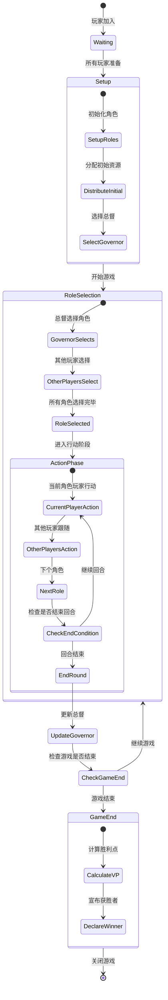

# 波多黎各桌游网页版架构设计

**版本**: MVP v1.0  
**支持人数**: 4-5人  
**创建日期**: 2026-03-08

---

## 1. 游戏机制简化版图（MVP版本）

### 1.1 核心游戏循环
波多黎各是一款经典的工人放置类策略游戏，玩家扮演殖民者开发波多黎各岛。MVP版本简化了原版游戏机制，保留核心玩法：

- **角色轮选制**: 每回合玩家选择不同角色（拓荒者、建筑师、市长、商人、船长）
- **双重胜利条件**: 建筑分数 + 货物贸易分数
- **资源管理**: 种植作物（玉米、靛蓝、咖啡、烟草）并加工
- **建筑建设**: 建造生产建筑和城市建筑
- **船只贸易**: 将货物运往欧洲换取胜利点

### 1.2 MVP版本简化点
1. **移除高级建筑**: 保留基础生产建筑和小型/大型建筑
2. **简化贸易**: 固定货物价值，移除市场波动
3. **固定船只**: 预设3艘船，容量分别为4、5、6
4. **移除外籍工人**: 简化人口增长机制
5. **固定VP池**: 游戏结束时VP最多的玩家获胜

### 1.3 游戏组件
- **玩家面板**: 个人资源、作物种植园、建筑物
- **中央岛屿板**: 公共作物堆、建筑市场、船只、贸易站
- **角色卡**: 5个角色（拓荒者、建筑师、市长、商人、船长）
- **资源标记**: 玉米、靛蓝、咖啡、烟草、糖（5种）
- **VP标记**: 胜利点数
- **杜布隆币**: 游戏货币

---

## 2. 技术栈选择

### 2.1 技术选型对比表

| 技术维度 | 选项A (推荐) | 选项B | 选项C | 选择理由 |
|---------|------------|-------|-------|---------|
| **前端框架** | React 18 + TypeScript | Vue 3 + TypeScript | Svelte + TypeScript | React生态丰富，状态管理方案成熟，适合复杂游戏状态 |
| **状态管理** | Zustand + Immer | Redux Toolkit | MobX | Zustand轻量级，Immer保证不可变状态，适合游戏状态频繁更新 |
| **实时通信** | Socket.IO | WebSocket原生 | Colyseus | Socket.IO成熟稳定，自动降级，适合实时游戏 |
| **后端框架** | Node.js + Express | NestJS | Fastify | Express简单灵活，快速开发MVP |
| **数据持久化** | Redis + MongoDB | PostgreSQL | In-Memory | Redis缓存游戏状态，MongoDB存储游戏记录 |
| **部署方案** | Docker + Nginx | Vercel/Netlify | 传统VPS | Docker容器化便于部署和扩展 |
| **UI组件库** | Tailwind CSS + Headless UI | MUI | Ant Design | Tailwind灵活定制，适合游戏UI设计 |
| **动画库** | Framer Motion | React Spring | CSS Animation | Framer Motion流畅自然，适合游戏交互 |

### 2.2 技术架构图

```
┌─────────────────────────────────────────────────────────────┐
│                        客户端层 (浏览器)                      │
│  ┌─────────────────────────────────────────────────────────┐ │
│  │  React 18 + TypeScript                                   │ │
│  │  ├─ Zustand (全局状态管理)                               │ │
│  │  ├─ Framer Motion (动画效果)                            │ │
│  │  └─ Tailwind CSS (样式)                                │ │
│  └─────────────────────────────────────────────────────────┘ │
│                            ↕ WebSocket                       │
├─────────────────────────────────────────────────────────────┤
│                        实时通信层                           │
│  ┌─────────────────────────────────────────────────────────┐ │
│  │  Socket.IO Server (房间管理、广播)                        │ │
│  │  ├─ 游戏房间匹配                                         │ │
│  │  └─ 实时状态同步                                         │ │
│  └─────────────────────────────────────────────────────────┘ │
├─────────────────────────────────────────────────────────────┤
│                        游戏逻辑层                           │
│  ┌─────────────────────────────────────────────────────────┐ │
│  │  Node.js + Express                                       │ │
│  │  ├─ 游戏状态机 (PuertoRicoGameState)                     │ │
│  │  ├─ 角色行为处理器 (RoleActionHandler)                   │ │
│  │  └─ 胜利条件计算器 (VictoryCalculator)                   │ │
│  └─────────────────────────────────────────────────────────┘ │
├─────────────────────────────────────────────────────────────┤
│                        数据存储层                           │
│  ┌─────────────────────────────────────────────────────────┐ │
│  │  Redis (实时游戏状态缓存)                                │ │
│  │  MongoDB (游戏记录、玩家统计)                            │ │
│  └─────────────────────────────────────────────────────────┘ │
└─────────────────────────────────────────────────────────────┘
```

### 2.3 开发环境
- **包管理**: pnpm (速度快，磁盘空间优化)
- **构建工具**: Vite (快速HMR，适合React开发)
- **代码规范**: ESLint + Prettier + TypeScript严格模式
- **测试**: Jest + React Testing Library (单元测试) + Cypress (E2E测试)
- **CI/CD**: GitHub Actions

---

## 3. 数据模型设计

### 3.1 核心数据结构

#### 游戏主状态 (GameState)
```typescript
interface GameState {
  gameId: string;
  status: 'waiting' | 'setup' | 'playing' | 'finished';
  phase: 'roleSelection' | 'action' | 'gameEnd';
  currentRole: string | null;
  currentPlayerIndex: number;
  roles: Role[];
  governorIndex: number;
  round: number;
  gameLog: GameLogEntry[];
  players: Player[];
  island: IslandBoard;
}
```

#### 玩家 (Player)
```typescript
interface Player {
  id: string;
  name: string;
  index: number;
  resources: Resources;
  plantations: Plantation[];
  buildings: Building[];
  colonists: ColonistCount;
  vpChips: number;
  doubloons: number;
}

interface Resources {
  corn: number;
  indigo: number;
  coffee: number;
  tobacco: number;
  sugar: number;
}
```

#### 建筑 (Building)
```typescript
interface Building {
  id: string;
  type: string;
  tier: 'production' | 'violet';
  cost: number;
  occupied: number;
  capacity: number;
  vp: number;
  active: boolean;
}
```

#### 角色 (Role)
```typescript
interface Role {
  key: string; // settler, builder, mayor, trader, captain
  name: string;
  doubloonValue: number;
  remainingDoubloons: number;
}
```

---

## 4. 角色系统

### 4.1 角色说明

#### 拓荒者 (Settler)
**功能**: 选择一块种植园放置在个人面板
**特权**: 可以花费杜布隆币购买一个采石场
**流程**:
1. 翻开岛屿板上等量的种植园卡
2. 玩家选择一块种植园放置在个人面板的空地块
3. 每回合只能种植一种作物

#### 建筑师 (Builder)
**功能**: 建造建筑物
**特权**: 所有建筑减少1个杜布隆币
**流程**:
1. 从建筑市场选择一座建筑
2. 支付建筑费用
3. 将建筑放置在个人面板的建筑区

#### 市长 (Mayor)
**功能**: 分配殖民者到种植园和建筑
**特权**: 额外获得1个殖民者优先分配
**流程**:
1. 从供应堆获取殖民者
2. 玩家依次分配殖民者到自己的种植园和建筑
3. 未使用的殖民者退回供应堆

#### 商人 (Trader)
**功能**: 将货物卖给贸易站换取杜布隆币
**特权**: 在普通玩家之前优先交易
**流程**:
1. 将一种货物卖给贸易站
2. 贸易站填满后无法再交易（3-5格）

#### 船长 (Captain)
**功能**: 将货物装载到船上运往欧洲获得VP
**特权**: 船长优先装载货物，可以多装1个货物
**流程**:
1. 选择一艘船装载货物
2. 每船只能装载一种货物，直到装满
3. 玩家依次装载，直到自愿停止或没有对应货物
4. 每装满1格获得1个VP
5. 未装载的货物可能损坏（留到下回合）

### 4.2 角色特权表

| 角色 | 基础功能 | 特权 | 金币奖励 |
|-----|---------|-----|---------|
| 拓荒者 | 种植作物 | 可买采石场 | 无 |
| 建筑师 | 建造建筑 | 建筑减1元 | 无 |
| 市长 | 分配工人 | 额外1个工人 | 无 |
| 商人 | 贸易货物 | 优先交易 | 根据货物 |
| 船长 | 运输货物 | 优先装载 | VP奖励 |

---

## 5. 回合流程状态机设计

### 5.1 Mermaid 状态机图



### 5.2 状态流程说明

#### 阶段1: 准备阶段 (Setup)
1. **初始化角色**: 将所有角色卡放置，每个角色获得0-3个金币
2. **分配初始资源**: 每个玩家获得1个种植园和2个杜布隆币
3. **选择总督**: 随机选择第一位总督

#### 阶段2: 角色选择 (Role Selection)
1. **总督先选**: 总督玩家首先选择一个角色并获得特权
2. **其他玩家选择**: 按顺时针方向依次选择剩余角色
3. **角色金币**: 选到角色卡的玩家获得角色上的所有金币

#### 阶段3: 行动阶段 (Action Phase)
1. **角色行动顺序**: 按角色顺序（拓荒者→建筑师→市长→商人→船长）依次行动
2. **当前角色玩家**: 角色拥有者使用特权并执行该角色功能
3. **其他玩家跟随**: 其他玩家可以选择是否执行该角色功能
4. **回合结束**: 所有角色行动完毕或触发结束条件

#### 阶段4: 回合结束 (End of Round)
1. **更新总督**: 将总督标记传递给下一位玩家
2. **补充金币**: 每个未选择的角色获得1个金币
3. **清空贸易站**: 如果贸易站已满，清空并重新开始
4. **检查结束条件**: VP池耗尽或总督循环完成

---

## 6. 胜利条件计算逻辑

### 6.1 胜利点来源

#### 1. 建筑物VP
```typescript
function calculateBuildingVP(player: Player): number {
  return player.buildings.reduce((total, building) => {
    if (building.active) {
      return total + building.vp;
    }
    return total;
  },