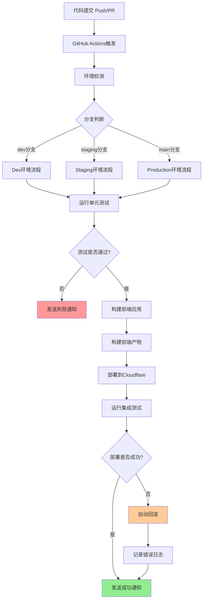

# 波多黎各桌游 - DevOps 流水线设计文档

## 目录
1. [项目概述](#项目概述)
2. [CI/CD 流水线架构](#cicd-流水线架构)
3. [GitHub API 集成](#github-api-集成)
4. [Cloudflare Pages 部署](#cloudflare-pages-部署)
5. [数据库与后端](#数据库与后端)
6. [监控与报警](#监控与报警)
7. [配置指南](#配置指南)
8. [运维操作手册](#运维操作手册)

---

## 项目概述

### 项目背景
波多黎各桌游网页版是一个基于 Web 的多人在线桌游平台，采用现代前端技术栈与实时通信技术构建。

### 技术栈
- **前端**: React 18, TypeScript, Vite, Socket.IO Client
- **后端**: Node.js, Express, Socket.IO Server
- **数据库**: MongoDB Atlas (游戏数据存储)
- **缓存**: Redis Cloud (会话与实时数据)
- **部署**: Cloudflare Pages (前端) + Cloudflare Workers (后端 API)
- **CI/CD**: GitHub Actions
- **监控**: Sentry, UptimeRobot

### 环境架构
```
┌─────────────────┐    ┌─────────────────┐    ┌─────────────────┐
│   Development   │    │    Staging      │    │   Production    │
│   (dev分支)      │    │   (staging分支)  │    │   (main分支)     │
└─────────┬───────┘    └─────────┬───────┘    └─────────┬───────┘
          │                      │                      │
          └──────────────────────┼──────────────────────┘
                                 │
                    ┌─────────────▼─────────────┐
                    │    GitHub Actions       │
                    │   CI/CD Pipeline        │
                    └─────────────┬─────────────┘
                                  │
            ┌───────────────────┼───────────────────┐
            │                   │                   │
    ┌───────▼───────┐   ┌──────▼──────┐   ┌──────▼──────┐
    │ Cloudflare    │   │ MongoDB     │   │ Redis       │
    │ Pages/Workers │   │ Atlas       │   │ Cloud       │
    │ (前端/后端)    │   │ (游戏数据)   │   │ (会话缓存)   │
    └───────────────┘   └─────────────┘   └─────────────┘
```

---

## CI/CD 流水线架构

### 流水线工作流程



---

## GitHub API 集成

### 1. Pull Request 自动化检查

```yaml
# .github/workflows/pr-check.yml
name: PR Automation Check

on:
  pull_request:
    types: [opened, edited, synchronize, reopened]

jobs:
  pr-check:
    runs-on: ubuntu-latest
    steps:
      - name: Checkout代码
        uses: actions/checkout@v4
        
      - name: PR标题验证
        uses: amannn/action-semantic-pull-request@v5
        env:
          GITHUB_TOKEN: ${{ secrets.GITHUB_TOKEN }}
        with:
          types: |
            feat
            fix
            docs
            style
            refactor
            test
            chore
            
      - name: 检查PR描述
        uses: actions/github-script@v6
        with:
          script: |
            const body = context.payload.pull_request.body;
            if (!body || body.length < 20) {
              core.setFailed('PR描述至少需要20个字符');
            }
            
  assign-reviewers:
    runs-on: ubuntu-latest
    steps:
      - name: 自动分配审查者
        uses: kentaro-m/auto-assign-action@v1.2.5
        with:
          configuration-path: '.github/auto_assign.yml'
```

### 2. Issue 管理与项目看板自动化

```yaml
# .github/workflows/issue-project.yml
name: Issue Project Automation

on:
  issues:
    types: [opened, labeled]

jobs:
  assign-to-project:
    runs-on: ubuntu-latest
    steps:
      - name: 添加到项目看板
        uses: actions/add-to-project@v0.5.0
        with:
          project-url: https://github.com/users/username/projects/1
          github-token: ${{ secrets.PROJECT_TOKEN }}
          
      - name: 自动标签
        uses: github/issue-labeler@v3.0
        with:
          repo-token: ${{ secrets.GITHUB_TOKEN }}
          configuration-path: .github/labeler.yml
          enable-versioned-regex: 0
```

### 3. Release 自动化发布

```yaml
# .github/workflows/release.yml
name: Release Automation

on:
  push:
    tags:
      - 'v*'

jobs:
  release:
    runs-on: ubuntu-latest
    steps:
      - name: Checkout代码
        uses: actions/checkout@v4
        with:
          fetch-depth: 0
          
      - name: 生成Release Notes
        id: release_notes
        run: |
          PREVIOUS_TAG=$(git describe --tags --abbrev=0 HEAD~1 2>/dev/null || echo "")
          if [ -z "$PREVIOUS_TAG" ]; then
            CHANGELOG=$(git log --pretty=format:"- %s" HEAD~10..HEAD)
          else
            CHANGELOG=$(git log --pretty=format:"- %s" ${PREVIOUS_TAG}..HEAD)
          fi
          echo "CHANGELOG<<EOF" >> $GITHUB_ENV
          echo "$CHANGELOG" >> $GITHUB_ENV
          echo "EOF" >> $GITHUB_ENV
          
      - name: 创建Release
        uses: actions/create-release@v1
        env:
          GITHUB_TOKEN: ${{ secrets.GITHUB_TOKEN }}
        with:
          tag_name: ${{ github.ref }}
          release_name: Release ${{ github.ref }}
          body: |
            ## 更新内容
            ${{ env.CHANGELOG }}
            
            ## 部署环境
            - 前端: https://puerto-rico-game.pages.dev
            - API: https://api.puerto-rico-game.workers.dev
          draft: false
          prerelease: false
```

---

## Cloudflare Pages 部署

### 1. Worker 设置与 API Token

```bash
#!/bin/bash
# scripts/setup-cloudflare.sh

set -e

echo "设置Cloudflare环境..."

# 检查wrangler是否安装
if ! command -v wrangler &> /dev/null; then
    echo "安装Wrangler CLI..."
    npm install -g wrangler
fi

# 登录Cloudflare
wrangler login

# 创建API Token
echo "请创建具有以下权限的API Token:"
echo "- Account:Cloudflare Pages:Edit"
echo "- Account:Cloudflare Workers:Edit"
echo "- User:User Details:Read"
echo "- Zone:Zone:Read"
echo "- Zone:DNS:Edit"

echo "API Token创建完成后，保存到GitHub Secrets: CLOUDFLARE_API_TOKEN"
echo "同时保存Account ID到GitHub Secrets: CLOUDFLARE_ACCOUNT_ID"

# 获取Account ID
# wrangler whoami
```

### 2. Cloudflare Pages 项目配置

```toml
# wrangler.toml

# Production环境
[env.production]
name = "puerto-rico-game"

# Staging环境
[env.staging]
name = "puerto-rico-game-staging"

# Development环境
[env.development]
name = "puerto-rico-game-dev"

# Pages配置
[[pages]]
project_name = "puerto-rico-game"
# Development
[env.development.pages]
project_name = "puerto-rico-game-dev"

# Staging
[env.staging.pages]
project_name = "puerto-rico-game-staging"

# Workers配置
[build]
command = "npm run build:worker"

# Environment Variables
[env.production.vars]
ENVIRONMENT = "production"
API_BASE_URL = "https://api.puerto-rico-game.workers.dev"

[env.staging.vars]
ENVIRONMENT = "staging"
API_BASE_URL = "https://staging-api.puerto-rico-game.workers.dev"

[env.development.vars]
ENVIRONMENT = "development"
API_BASE_URL = "https://dev-api.puerto-rico-game.workers.dev"

# KV Namespaces
[[kv_namespaces]]
binding = "GAME_STORE"
id = "your_production_kv_id"
preview_id = "your_preview_kv_id"

[[kv_namespaces]]
binding = "SESSION_STORE"
id = "your_production_session_id"
preview_id = "your_preview_session_id"

# Durable Objects
[[durable_objects.bindings]]
name = "GAME_ROOM"
class_name = "GameRoom"

[[migrations]]
tag = "v1"
new_classes = ["GameRoom"]
```

### 3. 自定义域名配置

```bash
#!/bin/bash
# scripts/setup-custom-domain.sh

# Production域名配置
wrangler pages domain add puerto-rico-game.com --project-name=puerto-rico-game
wrangler pages domain add www.puerto-rico-game.com --project-name=puerto-rico-game

# Staging域名配置
wrangler pages domain add staging.puerto-rico-game.com --