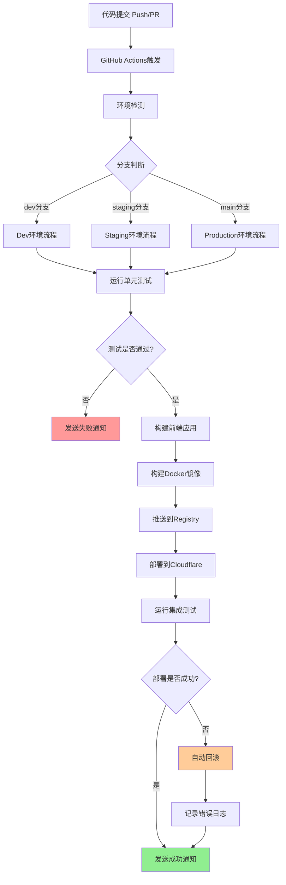

# 波多黎各桌游 - DevOps 流水线设计文档

## 目录
1. [项目概述](#项目概述)
2. [CI/CD 流水线架构](#cicd-流水线架构)
3. [GitHub API 集成](#github-api-集成)
4. [Cloudflare Pages 部署](#cloudflare-pages-部署)
5. [数据库与后端](#数据库与后端)
6. [监控与报警](#监控与报警)
7. [配置指南](#配置指南)
8. [运维操作手册](#运维操作手册)

---

## 项目概述

### 项目背景
波多黎各桌游网页版是一个基于 Web 的多人在线桌游平台，采用现代前端技术栈与实时通信技术构建。

### 技术栈
- **前端**: React 18, TypeScript, Vite, Socket.IO Client
- **后端**: Node.js, Express, Socket.IO Server
- **数据库**: MongoDB Atlas (游戏数据存储)
- **缓存**: Redis Cloud (会话与实时数据)
- **部署**: Cloudflare Pages (前端) + Cloudflare Workers (后端 API)
- **CI/CD**: GitHub Actions
- **监控**: Sentry, UptimeRobot

### 环境架构
```
┌─────────────────┐    ┌─────────────────┐    ┌─────────────────┐
│   Development   │    │    Staging      │    │   Production    │
│   (dev分支)      │    │   (staging分支)  │    │   (main分支)     │
└─────────┬───────┘    └─────────┬───────┘    └─────────┬───────┘
          │                      │                      │
          └──────────────────────┼──────────────────────┘
                                 │
                    ┌─────────────▼─────────────┐
                    │    GitHub Actions       │
                    │   CI/CD Pipeline        │
                    └─────────────┬─────────────┘
                                  │
            ┌───────────────────┼───────────────────┐
            │                   │                   │
    ┌───────▼───────┐   ┌──────▼──────┐   ┌──────▼──────┐
    │ Cloudflare    │   │ MongoDB     │   │ Redis       │
    │ Pages/Workers │   │ Atlas       │   │ Cloud       │
    │ (前端/后端)    │   │ (游戏数据)   │   │ (会话缓存)   │
    └───────────────┘   └─────────────┘   └─────────────┘
```

---

## CI/CD 流水线架构

### 流水线工作流程



### GitHub Actions 工作流设计

#### 1. 基础配置 (.github/workflows/ci-cd.yml)

```yaml
name: CI/CD Pipeline

on:
  push:
    branches: [dev, staging, main]
  pull_request:
    branches: [dev, staging, main]
    types: [opened, synchronize, reopened, closed]

env:
  NODE_VERSION: '18'
  PNPM_VERSION: '8'

jobs:
  # 代码质量检查
  lint-and-test:
    name: 代码质量检查与测试
    runs-on: ubuntu-latest
    steps:
      - name: Checkout代码
        uses: actions/checkout@v4
        
      - name: 设置Node.js
        uses: actions/setup-node@v4
        with:
          node-version: ${{ env.NODE_VERSION }}
          
      - name: 设置PNPM
        uses: pnpm/action-setup@v2
        with:
          version: ${{ env.PNPM_VERSION }}
          
      - name: 安装依赖
        run: pnpm install --frozen-lockfile
        
      - name: 运行ESLint
        run: pnpm lint
        
      - name: 运行类型检查
        run: pnpm type-check
        
      - name: 运行单元测试
        run: pnpm test:unit
        
      - name: 上传覆盖率报告
        uses: codecov/codecov-action@v3
        if: success()
        
  # 构建应用
  build:
    name: 构建应用
    needs: lint-and-test
    runs-on: ubuntu-latest
    outputs:
      environment: ${{ steps.set-env.outputs.environment }}
      version: ${{ steps.set-version.outputs.version }}
    steps:
      - name: Checkout代码
        uses: actions/checkout@v4
        
      - name: 设置环境变量
        id: set-env
        run: |
          if [[ $GITHUB_REF == 'refs/heads/main' ]]; then
            echo "environment=production" >> $GITHUB_OUTPUT
          elif [[ $GITHUB_REF == 'refs/heads/staging' ]]; then
            echo "environment=staging" >> $GITHUB_OUTPUT
          else
            echo "environment=development" >> $GITHUB_OUTPUT
          fi
          
      - name: 设置版本号
        id: set-version
        run: |
          VERSION=$(node -p "require('./package.json').version")-${GITHUB_SHA::7}
          echo "version=$VERSION" >> $GITHUB_OUTPUT
          echo "VERSION=$VERSION" >> $GITHUB_ENV
          
      - name: 构建前端应用
        run: |
          pnpm build
          echo "Build completed for ${{ steps.set-env.outputs.environment }}"
          
      - name: 上传构建产物
        uses: actions/upload-artifact@v3
        with:
          name: build-files-${{ steps.set-env.outputs.environment }}
          path: dist/
          retention-days: 7
```

#### 2. 多环境部署策略

```yaml
  # 部署到Development
  deploy-dev:
    name: 部署到Development环境
    needs: build
    runs-on: ubuntu-latest
    if: github.ref == 'refs/heads/dev'
    environment: development
    steps:
      - name: 下载构建产物
        uses: actions/download-artifact@v3
        with:
          name: build-files-development
          path: dist/
          
      - name: 部署到Cloudflare Pages (Dev)
        uses: cloudflare/pages-action@v1
        with:
          apiToken: ${{ secrets.CLOUDFLARE_API_TOKEN }}
          accountId: ${{ secrets.CLOUDFLARE_ACCOUNT_ID }}
          projectName: puerto-rico-game-dev
          directory: dist
          gitHubToken: ${{ secrets.GITHUB_TOKEN }}
          
      - name: 运行集成测试
        run: pnpm test:integration
        env:
          TEST_ENV: development
          GAME_API_URL: ${{ secrets.DEV_GAME_API_URL }}
          
  # 部署到Staging
  deploy-staging:
    name: 部署到Staging环境
    needs: build
    runs-on: ubuntu-latest
    if: github.ref == 'refs/heads/staging'
    environment: staging
    steps:
      - name: 下载构建产物
        uses: actions/download-artifact@v3
        with:
          name: build-files-staging
          path: dist/
          
      - name: 部署到Cloudflare Pages (Staging)
        uses: cloudflare/pages-action@v1
        with:
          apiToken: ${{ secrets.CLOUDFLARE_API_TOKEN }}
          accountId: ${{ secrets.CLOUDFLARE_ACCOUNT_ID }}
          projectName: puerto-rico-game-staging
          directory: dist
          gitHubToken: ${{ secrets.GITHUB_TOKEN }}
          
      - name: 部署Socket.IO Worker
        run: |
          pnpm deploy:worker --env staging
        env:
          CLOUDFLARE_API_TOKEN: ${{ secrets.CLOUDFLARE_API_TOKEN }}
          MONGODB_URI: ${{ secrets.STAGING_MONGODB_URI }}
          REDIS_URL: ${{ secrets.STAGING_REDIS_URL }}
          
  # 部署到Production
  deploy-production:
    name: 部署到Production环境
    needs: build
    runs-on: ubuntu-latest
    if: github.ref == 'refs/heads/main'
    environment: production
    steps:
      - name: 下载构建产物
        uses: actions/download-artifact@v3
        with:
          name: build-files-production
          path: dist/
          
      - name: 创建Release Tag
        run: |
          VERSION=$(node -p "require('./package.json').version")-${GITHUB_SHA::7}
          git tag -a v$VERSION -m "Release version $VERSION"
          git push origin v$VERSION
          
      - name: 部署到Cloudflare Pages (Production)
        uses: cloudflare/pages-action@v1
        with:
          apiToken: ${{ secrets.CLOUDFLARE_API_TOKEN }}
          accountId: ${{ secrets.CLOUDFLARE_ACCOUNT_ID }}
          projectName: puerto-rico-game
          directory: dist
          gitHubToken: ${{ secrets.GITHUB_TOKEN }}
          
      - name: 部署Socket.IO Worker (Production)
        run: |
          pnpm deploy:worker --env production
        env:
          CLOUDFLARE_API_TOKEN: ${{ secrets.CLOUDFLARE_API_TOKEN }}
          MONGODB_URI: ${{ secrets.PROD_MONGODB_URI }}
